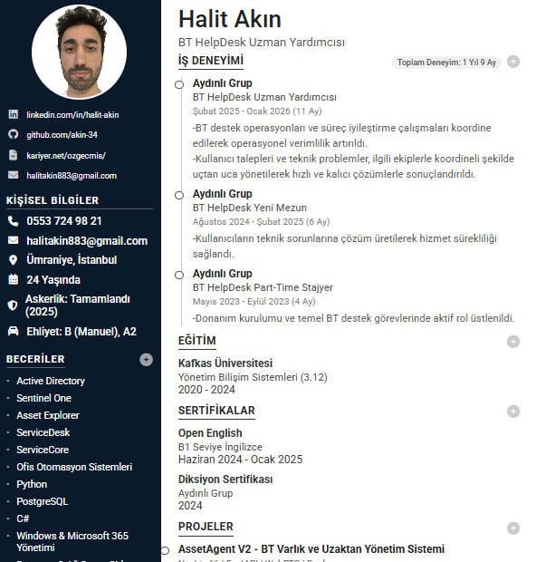

# 🛡️ CV Maker Pro — Tarayıcı Tabanlı Profesyonel Özgeçmiş Oluşturucu

   

**CV Maker Pro**, kurulum gerektirmeyen, tarayıcı tabanlı bir özgeçmiş oluşturucudur. Tek bir HTML dosyasını açarak tüm bölümleri doğrudan düzenleyebilir, profil fotoğrafı ekleyebilir ve tek tıkla profesyonel A4 PDF çıktısı alabilirsiniz.



---

## Özellikler

- **Gerçek zamanlı düzenleme** — Her alan doğrudan sayfada tıklanarak düzenlenebilir
- **Tek sayfa A4 PDF çıktısı** — PDF İndir butonuyla anında profesyonel özgeçmiş
- **Profil fotoğrafı yükleme** — Profil alanına tıklayarak fotoğraf eklenebilir
- **Bölüm yönetimi** — İş deneyimi, eğitim, sertifika, proje ve referans eklenip kaldırılabilir
- **Dil yetkinlik puanı** — Yıldız sistemiyle dil seviyesi görsel olarak belirtilebilir
- **Kurulum yok** — Node.js, Python veya herhangi bir araç gerekmez

---

## Hızlı Başlangıç

### Yöntem 1 — .bat ile Aç (Windows)
```
AC_CV_Maker_Pro.bat dosyasına çift tıklayın.
```

### Yöntem 2 — Manuel
```
index.html dosyasını herhangi bir modern tarayıcıda açın.
(Chrome, Edge veya Firefox önerilir)
```

---

## Proje Yapısı

```
CV-Maker-Pro/
├── index.html              # Ana uygulama
├── style.css               # Tasarım ve düzen
├── script.js               # PDF oluşturma ve etkileşim
├── AC_CV_Maker_Pro.bat     # Windows başlatıcı
└── assets/
    └── preview.png         # Önizleme görseli
```

---

## Eklenebilecekler

| Özellik | Açıklama |
|---|---|
| Çok dil desteği | TR / EN arasında toggle ile şablon metinleri |
| Şablon seçimi | Farklı renk paletleri ve sayfa düzeni seçenekleri |
| Otomatik kaydetme | LocalStorage ile tarayıcıda veri saklama |
| QR kod entegrasyonu | LinkedIn / GitHub profil linki QR olarak PDF'e ekleme |
| İçe / dışa aktarma | JSON formatında CV verisi yedekleme ve geri yükleme |
| Responsive tasarım | Mobil cihazlarda düzenleme desteği |

---

## Kullanılan Teknolojiler

- **HTML5** + **CSS3** + **Vanilla JavaScript**
- [html2pdf.js](https://github.com/eKoopmans/html2pdf.js) — PDF çıktısı
- [Font Awesome 6](https://fontawesome.com/) — İkonografya
- [Google Fonts — Roboto](https://fonts.google.com/specimen/Roboto) — Tipografi

---

## Lisans

Bu proje kişisel kullanım amacıyla geliştirilmiştir.

---

> Geliştirici: [Halit Akın](https://www.linkedin.com/in/halit-ak%C4%B1n-76787b226/) · [GitHub](https://github.com/akin-34)
